  

<h3><code>aman@github ~ $ ./contributions.sh</code></h3>

  

<h3><code>aman@github ~ $ neofetch</code></h3>

 

<h3><code>aman@github ~ $ toplangs</code></h3>

 

## 🌐 Socials
  

## 💻 Tech Stack
                
